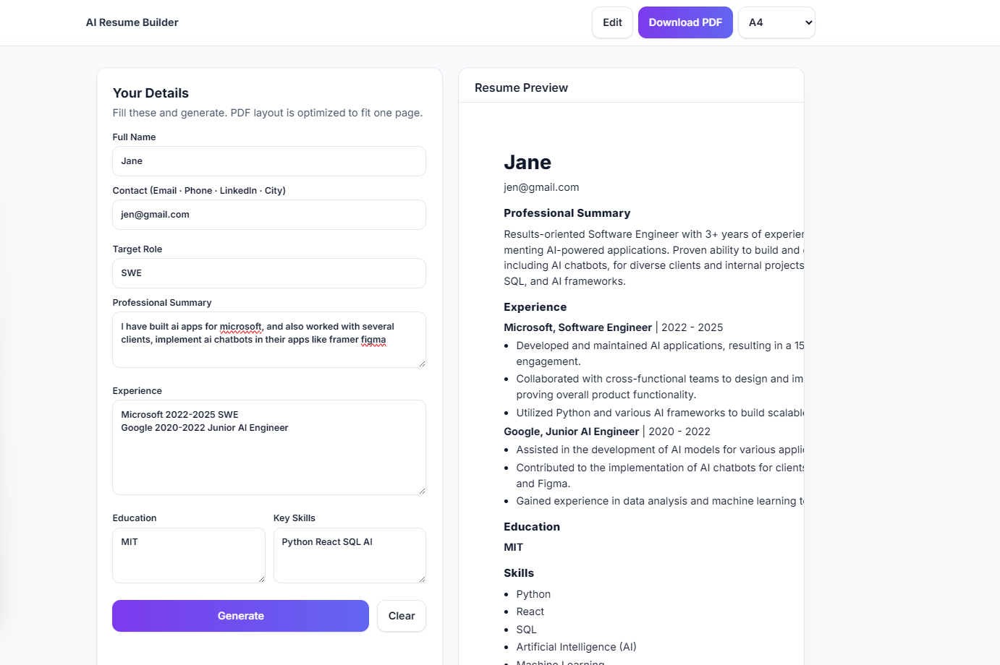

Absolutely ✅ — here’s the **complete, ready-to-copy** `README.md` file for your GitHub project.
It’s formatted beautifully for both **academic submission** and **portfolio presentation** — includes setup, API docs, screenshot, and future scope.

---

````markdown
# 🧠 AI Resume Builder

An **AI-powered resume generator** that instantly creates professional, ATS-friendly resumes using **Google Gemini API** and a modern **Python + TailwindCSS** interface.  
Built for simplicity, speed, and accuracy — just enter your details and get a complete, editable resume with one click.

---

## 🚀 Features

- 🤖 **AI-Powered Resume Generation** – Automatically creates resumes using AI based on your input.  
- 📝 **Inline Editing** – Edit your resume directly before exporting to PDF.  
- 🧾 **PDF Export** – Clean, print-ready PDF layout with perfect spacing.  
- 🎨 **Responsive UI** – Modern, minimal, and mobile-friendly design built with TailwindCSS.  
- 🔒 **Environment Secure** – Uses `.env` file for safe API key handling.

---

## 🧩 Tech Stack

| Component | Technology |
|------------|-------------|
| **Backend** | Python (FastAPI) |
| **Frontend** | HTML5, TailwindCSS, JavaScript |
| **AI Model** | Google Gemini 1.5 / 2.0 Flash |
| **PDF Export** | Browser-native print-to-PDF |
| **Version Control** | Git & GitHub |

---

## ⚙️ Installation & Setup

### 1️⃣ Clone the Repository
```bash
git clone https://github.com/<your-username>/AI-Resume-Builder.git
cd AI-Resume-Builder
````

### 2️⃣ Install Dependencies

```bash
pip install -r requirements.txt
```

### 3️⃣ Configure Environment Variables

Create a `.env` file in the same directory as `app.py`:

```bash
GEMINI_API_KEY=your_google_gemini_api_key_here
```

(See `.env.example` for reference.)

### 4️⃣ Run the Backend Server

```bash
uvicorn app:app --reload
```

Server starts at 👉 **[http://localhost:8000](http://localhost:8000)**

### 5️⃣ Open the Frontend

```bash
python -m http.server 8080
```

Then open 👉 **[http://localhost:8080](http://localhost:8080)** in your browser.

---

## 🧠 API Endpoint

| Method   | Endpoint        | Description                                                                        |
| -------- | --------------- | ---------------------------------------------------------------------------------- |
| **POST** | `/api/generate` | Sends user resume data to Gemini API and returns Markdown-formatted resume content |

**Sample Request:**

```json
{
  "fullName": "Jane Doe",
  "contactInfo": "jane@ex.com | (555) 123-4567 | Miami",
  "targetRole": "Software Engineer",
  "summary": "Results-driven developer skilled in AI & cloud technologies.",
  "experience": "Worked on chatbots, SaaS platforms, and automation tools.",
  "education": "B.Sc. Computer Science, Penn State University",
  "skills": "Python, React, TensorFlow, FastAPI"
}
```

**Sample Response:**

```json
{
  "markdown": "# Jane Doe\njane@ex.com | (555) 123-4567 | Miami\n\n## Professional Summary\nResults-driven developer skilled in AI & cloud technologies.\n\n## Experience\n* Developed AI chatbots for multiple clients.\n* Improved automation systems by 30%.\n\n## Education\nB.Sc. Computer Science, Penn State University\n\n## Skills\n* Python\n* FastAPI\n* React\n* TensorFlow"
}
```

---

## 📁 File Structure

```
📦 AI-Resume-Builder/
│
├── app.py              # Backend (FastAPI API)
├── index.html          # Frontend UI (TailwindCSS + JS)
├── requirements.txt    # Python dependencies
├── .env.example        # Example environment configuration
├── README.md           # Documentation
└── Screenshot.png      # Demo screenshot
```

> 💡 All files are placed in the root directory for **easy setup and grading**.
> This structure ensures both frontend and backend run without any additional path configuration.

---

## 🧾 Usage

1. Fill out your details in the left panel (name, skills, education, etc.)
2. Click **Generate Resume** to let the AI create your draft.
3. Edit your resume directly inline if needed.
4. Click **Save as PDF** to export a print-ready resume.

---

## 📸 Screenshot



---

## 🧭 Future Scope

* 🌐 Add LinkedIn and Indeed integration for auto-fill.
* 🧠 Include multiple AI resume templates (Modern, Minimalist, Corporate).
* 💾 Save and manage previous resumes locally or in the cloud.
* 🗣️ Add multilingual resume generation support.
* 🧩 Integrate AI-driven job-matching suggestions.

---

## 🛡️ License

This project is licensed under the [MIT License](LICENSE).
You can freely use, modify, and distribute it with proper attribution.

---

## ✨ Acknowledgments

* [Google Gemini API](https://ai.google.dev) for the powerful AI model.
* [TailwindCSS](https://tailwindcss.com) for the sleek, responsive UI.
* [FastAPI](https://fastapi.tiangolo.com) for the fast, async backend.

---

## 👩‍💻 Author

**Developed by:** *Ayushmaan Kartik*

---

⭐ *If you found this project helpful, consider giving it a star on GitHub!*

